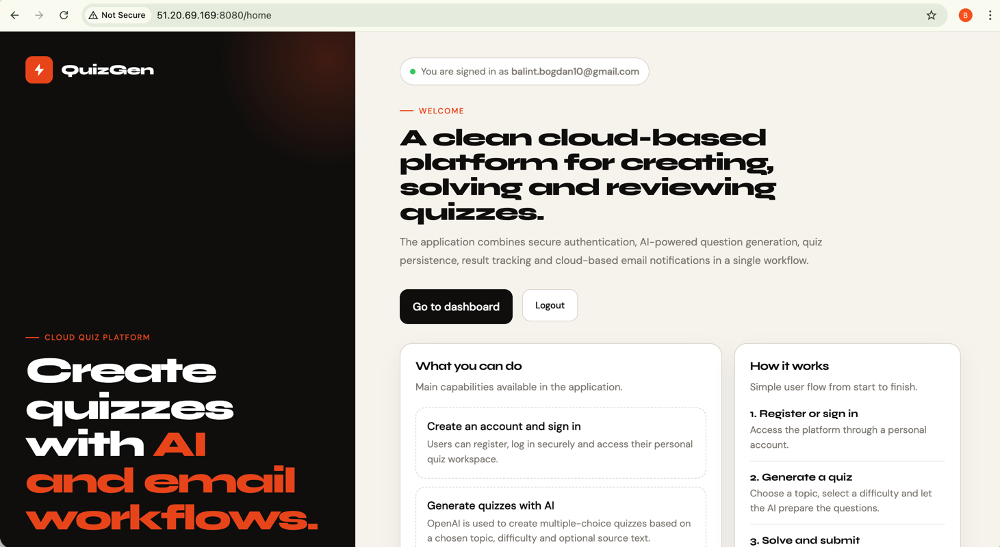

# Quiz Generator App
**Bogdan Balint**  
**Grupa: 1145**

## Link video prezentare
yt link TODO

## Link publicare
http://51.20.69.169:8080/

---

# 1. Introducere

Quiz Generator App este o aplicatie web dezvoltata pentru proiectul la Cloud Computing.  
Scopul aplicatiei este sa permita generarea automata de quiz-uri cu ajutorul unui serviciu AI, rezolvarea lor direct in browser si trimiterea rezultatelor prin email.

Aplicatia foloseste:
- Spring Boot pentru backend
- Thymeleaf pentru interfata web
- PostgreSQL pentru baza de date
- OpenAI API pentru generarea intrebarilor
- SendGrid pentru trimiterea emailurilor
- AWS EC2 pentru publicare in cloud

---

# 2. Descriere problema

Crearea manuala a quiz-urilor poate dura mult, mai ales atunci cand se doreste generarea rapida a mai multor intrebari pe baza unui subiect sau a unui text.

Aplicatia rezolva aceasta problema printr-un flux simplu:
- utilizatorul se inregistreaza si se autentifica
- alege un topic, o dificultate si numarul de intrebari
- aplicatia genereaza automat quiz-ul folosind OpenAI
- utilizatorul poate rezolva quiz-ul in aplicatie
- la final primeste scorul si un email cu rezultatul

---

# 3. Descriere API

Aplicatia foloseste doua servicii cloud externe:

## OpenAI API
Este folosit pentru generarea automata a intrebarilor grila.  
Backend-ul trimite catre OpenAI un prompt care contine:
- topic-ul quiz-ului
- dificultatea
- numarul de intrebari
- textul sursa optional

Raspunsul este in format JSON si contine intrebarile generate.

## SendGrid
Este folosit pentru trimiterea emailurilor.  
Aplicatia trimite:
- email de bun venit dupa inregistrare
- email cu rezultatul quiz-ului dupa finalizare

---

# 4. Flux de date

## Fluxul principal al aplicatiei

### Inregistrare
1. Utilizatorul completeaza formularul de register
2. Datele sunt salvate in baza de date
3. Se trimite un email de bun venit
4. Utilizatorul este redirectionat catre login

### Autentificare
1. Utilizatorul introduce email si parola
2. Spring Security valideaza datele
3. Se creeaza sesiunea
4. Utilizatorul ajunge in dashboard

### Creare quiz
1. Utilizatorul completeaza formularul de creare quiz
2. Aplicatia trimite cererea catre OpenAI
3. OpenAI returneaza intrebarile
4. Quiz-ul si intrebarile sunt salvate in PostgreSQL
5. Utilizatorul este redirectionat catre pagina de detalii

### Rezolvare quiz
1. Utilizatorul deschide quiz-ul
2. Selecteaza raspunsurile
3. Aplicatia calculeaza scorul
4. Rezultatul este salvat in baza de date
5. Se trimite email-ul cu rezultatul

## Exemple de endpointuri
- `GET /register`
- `POST /register`
- `GET /login`
- `POST /login`
- `GET /dashboard`
- `GET /quizzes/create`
- `POST /quizzes/create`
- `GET /quizzes/{id}`
- `GET /quizzes/{id}/solve`
- `POST /quizzes/{id}/submit`

## Metode HTTP folosite
- `GET`
- `POST`

## Autentificare si autorizare
Aplicatia foloseste:
- autentificare interna cu Spring Security si sesiune
- autentificare externa cu API key pentru OpenAI
- autentificare externa cu API key pentru SendGrid

---

# 5. Capturi ecran aplicatie

- Pagina Home
- 
- Pagina Register
- Pagina Login
- Dashboard
- Pagina Create Quiz
- Pagina Solve Quiz
- Pagina Result
- Exemple de email trimis

---

# 6. Tehnologii folosite

- Java 25
- Spring Boot
- Spring Security
- Spring Data JPA
- Thymeleaf
- PostgreSQL
- OpenAI API
- SendGrid
- AWS EC2
- Maven
- HTML/CSS

---

# 7. Structura bazei de date

Aplicatia foloseste o baza de date PostgreSQL cu urmatoarele tabele principale:
- `users`
- `quizzes`
- `questions`
- `quiz_attempts`
- `question_attempts`
- `email_logs`

Acestea sunt folosite pentru stocarea utilizatorilor, quiz-urilor generate, raspunsurilor date si emailurilor trimise.

---

# 8. Publicare

Aplicatia a fost publicata pe un server AWS EC2 cu Ubuntu.  
Pe server au fost instalate:
- Java
- PostgreSQL

Aplicatia Spring Boot a fost rulata sub forma de fisier JAR, iar accesul din exterior a fost permis prin configurarea portului `8080` in AWS Security Group.

Exemplu link public:

http://51.20.69.169:8080/

# 9. Functionalitati implementate

Pana in acest moment au fost implementate:

* register
* login/logout
* dashboard
* creare quiz
* generare quiz cu OpenAI
* rezolvare quiz
* calcul rezultat
* email de bun venit
* email cu rezultatul quiz-ului
* publicare in cloud

⸻

10. Referinte

* Spring Boot Documentation
* Spring Security Documentation
* Thymeleaf Documentation
* PostgreSQL Documentation
* OpenAI API Documentation
* SendGrid Documentation
* AWS EC2 Documentation 